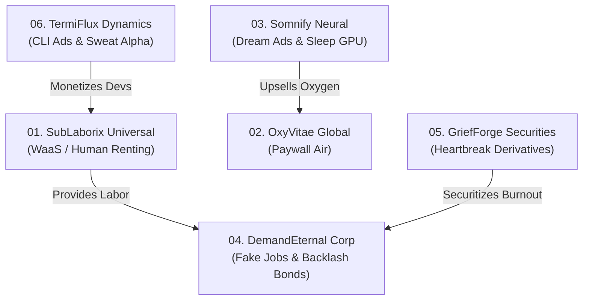

# 🏢 UNICORN WAREHOUSE FLAGSHIP PORTFOLIO OVERVIEW
> *"6 Companies. 6 Buckets. Total Market & Human Dominance."*

---

## Portfolio Executive Summary

This master portfolio synthesizes 35 tech startup pitches into **6 flagship mega-companies**. Each company represents a unified, hyper-monetized dystopian archetype engineered to pass venture capital underwriting while satirizing modern tech corporate overreach.

---

## Flagship Companies Index

| # | Company Name | Archetype | Core Tagline | Underwriter Valuation |
| :-: | :--- | :--- | :--- | :-: |
| **01** | **SubLaborix Universal** | Human Labor as a Service | *"Subscribe to humans, dominate every workflow."* | **$1.2B** |
| **02** | **OxyVitae Global** | Pay-to-Breathe Air | *"Inhale dominance, exhale mediocrity—breath is the new bandwidth."* | **$850M** |
| **03** | **Somnify Neural** | Sleep & Brain Compute Layer | *"Rest is the new compute layer."* | **$1.8B** |
| **04** | **DemandEternal Corp** | Synthetic Labor & Demand | *"Simulating labor's golden chains to forge eternal consumer demand."* | **$3.5B** |
| **05** | **GriefForge Securities** | Grief & Heartbreak Derivatives | *"Monetizing heartbreak: Every goodbye is just the start of a subscription."* | **$1.5B** |
| **06** | **TermiFlux Dynamics** | Biometric Socks & CLI Ads | *"Your sweat forecasts fortunes; your terminal broadcasts ads."* | **$750M** |

---

## Portfolio Interconnection Architecture

---

> [!NOTE]
> All 6 founding packages contain complete pitch decks, legal arbitrage strategies, underwriter investment memos, financial metrics, and Engineer Doomer audit counter-measures self-contained within their respective bucket documentation.
