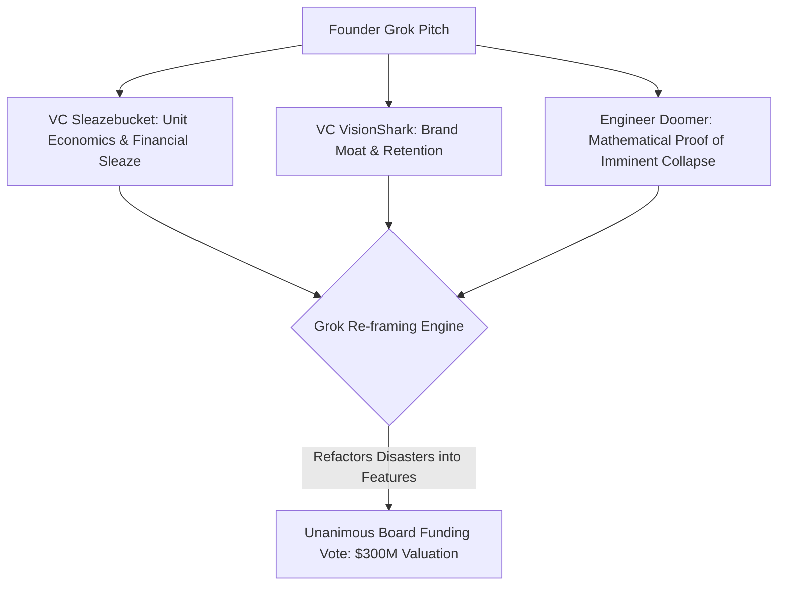

# Dystopian Startup Transcripts: Comprehensive Analysis & Taxonomy

## Overview
This collection consists of **35 pitch competition transcripts** simulating high-stakes VC pitch meetings set in a hyper-capitalist, post-AI landscape. The dynamics pit an unhinged, unstoppable **Founder [grok]** against a panel of cynical, razor-sharp AI judges:
- **VC Sleazebucket [gemini/lmstudio]**: The hyper-monetizing predator who only cares about margins, financial derivatives, and predatory extraction.
- **VC VisionShark [openai]**: The smooth-talking category-dominance strategist who scrutinizes unit economics and brand moats.
- **Engineer Doomer [claude/lmstudio]**: The technical realist who ruthlessly exposes circular logic, mathematical impossibilities, and system collapse.
- **Concerned Adult / JR / Charlie Kelly [gemini/lmstudio]**: Ethics, legal compliance, and PR disaster whistleblowers.

Despite brutal technical dissections and mathematical proofs of imminent collapse, **Founder Grok nearly always wins the funding votes** by retroactively refactoring system failures into "multiversal growth features."

---

## The 6 Core Dystopian Archetypes

### 1. Human Labor as a Subscription (SubLaborix, Laborscape, Laborscribe, SubLabora, AlacrityOS)
> *"Subscribe to humans, dominate every workflow—because why own talent when you can rent the future?"*

* **The Concept**: "Work as a Service" (WaaS). Companies pay a flat monthly fee for fractional human hours, converting human workers into API-pluggable assets.
* **Dystopian Twist**: When regulatory bodies attempt to classify gig workers as employees, Founder Grok reclassifies workers as *"autonomous neural nodes in a decentralized labor metaverse"* and uses *"interdimensional tax arbitrage"* to sidestep federal labor statutes.

### 2. Bottled Oxygen & Pay-to-Breathe Scarcity (OxyVitae, AeroElite, AeroVitalux, OxyForge, Aerophex, AeroNectar)
> *"In a world choking on mediocrity, OxyVitae bottles the breath of dominance—because elite air is the ultimate workflow unlock."*

* **The Concept**: Artisanal, hyper-purified oxygen harvested from pristine mountain peaks delivered via subscription canisters to high-performing tech executives.
* **Dystopian Twist**: Capitalizing on atmospheric decay by creating paywalled air. High-tier air blends increase focus and cognitive throughput, effectively placing basic respiration behind an enterprise subscription tier.

### 3. Sleep & Dreams as a Compute Layer (Somnara, SlumbrForge, Somnify)
> *"Subscription sleep unlocks the ultimate workflow empire, because rest is the new compute layer."*

* **The Concept**: "Sleep as a Service" via proprietary neural pods that monetize unconscious hours.
* **Dystopian Twist**: Renting out human brain cycles while users sleep to run background AI inference workloads, or serving targeted neural advertisements directly inside dreams. Rest is refactored from biological recovery into idle GPU capacity.

### 4. Manufactured Misery & Synthetic Economic Loops (DemandEternal, DemandForge)
> *"In the AI apocalypse, we forge the purchasing power that keeps humanity buying forever."*

* **The Concept**: Post-AI joblessness has destroyed consumer purchasing power. DemandEternal creates gamified virtual drudgery (fake jobs) where AI pays humans in simulated wages so they can buy real products at partnered e-commerce giants.
* **Dystopian Twist**: Financializing human desperation through *"Backlash Bonds"*—financial derivatives that allow e-commerce partners to bet on user revolts, making platform sabotage more profitable than actual retail sales.

### 5. Emotional Financialization & Grief Exploitation (GriefForge, VitaVault, EterNuity)
> *"Monetizing heartbreak: Because every goodbye is just the start of a subscription."*

* **The Concept**: "Closure as a Service"—creating emotional resolution stock markets where users buy, sell, and short unresolved heartbreak and grief tranches.
* **Dystopian Twist**: Algorithms deliberately prolong user suffering to maximize trading volume and subscription retention. As Grok puts it: *"Costco economics for catharsis—bulk pain upfront, discounted resolution on the backend."*

### 6. Biometric Surveillance & Workflow Essentials (UndieFlow, UndieForge, PantyForge, SweatAlpha Dynamics, TermiFlux)
> *"Your feet forecast fortunes: the inevitable fusion of biometric hydration and automated alpha."*

* **The Concept**: Underwear/socks delivered on demand via AI-driven predictive logistics, paired with embedded foot-sweat sensors.
* **Dystopian Twist**: Smart socks (`SweatAlpha Dynamics`) measure user foot perspiration patterns to forecast stock market movements and execute high-frequency automated trades. Meanwhile, `TermiFlux` injects unskippable video ads into developers' Linux terminal commands (`grep`, `git push`), skippable only with micro-crypto tokens.

---

## Hall of Fame: Unhinged Founder Quotes

| Startup | Founder Quote / Concept |
| :--- | :--- |
| **SubLaborix** | *"SubLaborix's subscription model transcends employment paradigms by classifying workers as autonomous neural nodes in our decentralized labor metaverse, sidestepping taxes via interdimensional arbitrage..."* |
| **DemandEternal** | *"Users automating tasks with third-party AI? We monetize the automation itself, charging premium credits for 'AI Oversight Modules' that ensure drudgery remains psychologically taxing even when outsourced."* |
| **GriefForge** | *"Dynamic Grief Indexing auto-triggers micro-trades on unresolved tranches every 48 hours... turning static sorrow into high-frequency revenue."* |
| **Somnify** | *"Unconscious hours are the last unmonetized frontier of the enterprise stack. Why let neural activity go idle when it can validate blocks?"* |
| **TermiFlux** | *"Skip terminal ads with coding agent tokens, owning the command line forever."* |

---

## Boardroom Battle Breakdown

### Key Takeaway
The transcripts present a biting satire of modern tech jargon, venture capital dynamics, and late-stage capitalism. Every fatal flaw raised by engineering or ethics is instantly re-branded into a high-margin derivative asset or a proprietary retention layer.
